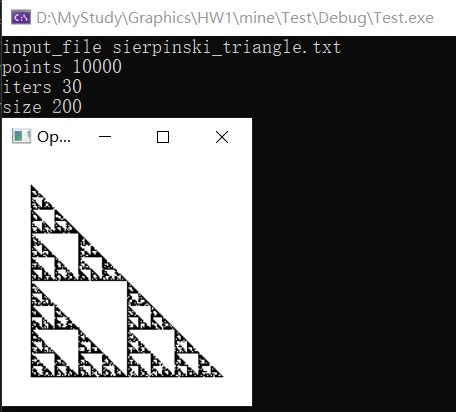

# Work1: To draw an interesting IFS    
code in [HW1](./HW1/)
## 实验目的
- 1. To read, compile and understand the provided files.
- 2. To draw a new IFS: 
  - a) figure out the transformations and probabilities
  - b) implement an interesting color scheme
## 实验软件和硬件环境
- VS2019
- Opengl
- PC
## 实验原理和方法
使用IFS迭代函数系统，构造分形进行绘制

## 实验步骤
### 1.对点的操作
#### 主要思路
- 首先在 x[0,1],y[0,1],z[0,1] 的范围上生成随机点。当点足够多的时候，是一个正方形。
- 对生成的每一个点随机进行n种变换，如，针对sierpinski_triangle，包含三种变换：先缩小为原来的一半然后向右平移向上平移和不变。
- 变换使用轮盘作选择，读取对应的txt文件，计算 $p_i$ 。生成一个[0,1]之间的随机数 $p$，当 $p_i$<=p<$p_{i+1}$ 时，做第 $i$ 个变换。
#### 主要代码
```C
void sierpinski_triangle_point(Vec3f &v, ArgParser* args) {
    for (int j = 0; j < args->iters; j++) {
        double p = args->mtrand.rand();
        //轮盘 找到做哪个变换
        Matrix m = matrixs[0];
        for (int i = 0; i < num_transforms - 1; i++)
        {
            if (p > probabilities[i] && p <= probabilities[i + 1]) {
                m = matrixs[i + 1];//选取对应的变换矩阵
                break;
            }
        }
        v = m * v;//进行变换
    }
}
```
#### 运行结果
- 执行命令`ifs.exe -input sierpinski_triangle.txt -points 10000 -iters 30 -size 200`

  <!--  -->

- 执行命令`ifs.exe -input dragon.txt -points 10000 -iters 30 -size 200`

  <!--  -->

- 执行命令`ifs.exe -input fern.txt -points 10000 -iters 30 -size 200`

  <!--  -->

- 执行命令`ifs.exe -input giant_x.txt -points 10000 -iters 30 -size 200`

  <!--  -->

- 执行命令`ifs.exe -input cube.txt -points 10000 -iters 30 -size 200`
  (cube.txt的描述见 2.对cube的操作 )

<!---->  

### 2.对cube的操作

#### 主要思路

- 首先构造正方体的变换矩阵，最终结果是一个正方体经过一次会变成20个小正方体。
- 变换如下：
    - 首先对最原始的正方体缩小为原来的1/27(每个边缩小为原来的1/3)
    - 去除6个面的中心正方体和最中间的正方体。最终获得27-6-1=20个正方体
    - 左上角3×3矩阵控制旋转，最后一列前三项控制平移

#### cube.txt如下

```
20
0.05
0.333333 0.000000 0.000000 0.000000 
0.000000 0.333333 0.000000 0.000000 
0.000000 0.000000 0.333333 0.000000 
0.000000 0.000000 0.000000 1.000000 
0.05
0.333333 0.000000 0.000000 0.333333 
0.000000 0.333333 0.000000 0.000000 
0.000000 0.000000 0.333333 0.000000 
0.000000 0.000000 0.000000 1.000000 
0.05 
0.333333 0.000000 0.000000 0.666666 
0.000000 0.333333 0.000000 0.000000 
0.000000 0.000000 0.333333 0.000000 
0.000000 0.000000 0.000000 1.000000 
0.05
0.333333 0.000000 0.000000 0.000000 
0.000000 0.333333 0.000000 0.333333 
0.000000 0.000000 0.333333 0.000000 
0.000000 0.000000 0.000000 1.000000 
0.05 
0.333333 0.000000 0.000000 0.666666 
0.000000 0.333333 0.000000 0.333333 
0.000000 0.000000 0.333333 0.000000 
0.000000 0.000000 0.000000 1.000000 
0.05
0.333333 0.000000 0.000000 0.000000 
0.000000 0.333333 0.000000 0.666666 
0.000000 0.000000 0.333333 0.000000 
0.000000 0.000000 0.000000 1.000000 
0.05
0.333333 0.000000 0.000000 0.333333 
0.000000 0.333333 0.000000 0.666666 
0.000000 0.000000 0.333333 0.000000 
0.000000 0.000000 0.000000 1.000000 
0.05 
0.333333 0.000000 0.000000 0.666666 
0.000000 0.333333 0.000000 0.666666 
0.000000 0.000000 0.333333 0.000000 
0.000000 0.000000 0.000000 1.000000 
0.05
0.333333 0.000000 0.000000 0.000000 
0.000000 0.333333 0.000000 0.000000 
0.000000 0.000000 0.333333 0.333333 
0.000000 0.000000 0.000000 1.000000 
0.05 
0.333333 0.000000 0.000000 0.666666 
0.000000 0.333333 0.000000 0.000000 
0.000000 0.000000 0.333333 0.333333 
0.000000 0.000000 0.000000 1.000000  
0.05
0.333333 0.000000 0.000000 0.000000 
0.000000 0.333333 0.000000 0.666666 
0.000000 0.000000 0.333333 0.333333 
0.000000 0.000000 0.000000 1.000000 
0.05 
0.333333 0.000000 0.000000 0.666666 
0.000000 0.333333 0.000000 0.666666
0.000000 0.000000 0.333333 0.333333 
0.000000 0.000000 0.000000 1.000000 
0.05
0.333333 0.000000 0.000000 0.000000 
0.000000 0.333333 0.000000 0.000000 
0.000000 0.000000 0.333333 0.666666 
0.000000 0.000000 0.000000 1.000000 
0.05
0.333333 0.000000 0.000000 0.333333 
0.000000 0.333333 0.000000 0.000000 
0.000000 0.000000 0.333333 0.666666 
0.000000 0.000000 0.000000 1.000000 
0.05
0.333333 0.000000 0.000000 0.666666 
0.000000 0.333333 0.000000 0.000000 
0.000000 0.000000 0.333333 0.666666 
0.000000 0.000000 0.000000 1.000000 
0.05
0.333333 0.000000 0.000000 0.000000 
0.000000 0.333333 0.000000 0.333333 
0.000000 0.000000 0.333333 0.666666 
0.000000 0.000000 0.000000 1.000000 
0.05
0.333333 0.000000 0.000000 0.666666 
0.000000 0.333333 0.000000 0.333333 
0.000000 0.000000 0.333333 0.666666 
0.000000 0.000000 0.000000 1.000000 
0.05
0.333333 0.000000 0.000000 0.000000 
0.000000 0.333333 0.000000 0.666666 
0.000000 0.000000 0.333333 0.666666 
0.000000 0.000000 0.000000 1.000000 
0.05
0.333333 0.000000 0.000000 0.333333 
0.000000 0.333333 0.000000 0.666666 
0.000000 0.000000 0.333333 0.666666 
0.000000 0.000000 0.000000 1.000000 
0.05
0.333333 0.000000 0.000000 0.666666 
0.000000 0.333333 0.000000 0.666666 
0.000000 0.000000 0.333333 0.666666 
0.000000 0.000000 0.000000 1.000000 
```

#### 主要代码

对于同一个 cube 的顶点，进行相同的转换，顶点数也会变为原来的 20 倍。
假设具有原始顶点集合 cube_verts_origin ，i 表示第 i 个 cube，j 表示第 i 个 cube 中的第 j 个顶点, it 表示i个 cube 的第 it 次变换。
那么对应的转换关系为 cube_verts_new[i*20*24+it*24+j] = cube_verts_origin[i * 24 + j]。
```C
//转换一次cube
VBOVertex* translateCube(VBOVertex* cube_verts_origin,int size)
{
    VBOVertex* cube_verts_new = new VBOVertex[size *20];
    int cube_size = size / 24;
    for (int i = 0; i < cube_size; i++) {
        for (int it = 0; it < 20; it++) {
            Matrix m = matrixs[it];
            for (int j = 0; j < 24; j++) {
                //cube_verts_new[i*480+it*24+j] = m * cube_verts_origin[i * 24 + j];
                Vec3f v_origin(cube_verts_origin[i * 24 + j].x, 
                                cube_verts_origin[i * 24 + j].y, 
                                cube_verts_origin[i * 24 + j].z);
                Vec3f v_new = m * v_origin;
                cube_verts_new[i * 480 + it * 24 + j].x = v_new.x();
                cube_verts_new[i * 480 + it * 24 + j].y = v_new.y();
                cube_verts_new[i * 480 + it * 24 + j].z = v_new.z();
                cube_verts_new[i * 480 + it * 24 + j].nx = cube_verts_origin[i * 24 + j].nx;
                cube_verts_new[i * 480 + it * 24 + j].ny = cube_verts_origin[i * 24 + j].ny;
                cube_verts_new[i * 480 + it * 24 + j].nz = cube_verts_origin[i * 24 + j].nz;            
                cube_verts_new[i * 480 + it * 24 + j].cx = cube_verts_origin[i * 24 + j].cx;
                cube_verts_new[i * 480 + it * 24 + j].cy = cube_verts_origin[i * 24 + j].cy;
                cube_verts_new[i * 480 + it * 24 + j].cz = cube_verts_origin[i * 24 + j].cz;
            }
        }
    }
    return cube_verts_new;
}
```
#### 运行结果
执行命令`ifs.exe -input cube.txt -points 10000 -iters 3 -size 200 -cubes`


<!--  -->

### 3.cube颜色转换
因为所有的转换都是从初始的cube变换的，随机设置初始的颜色。
#### 主要代码
增添新的argv参数，使用"-color"控制颜色变换
```C
   if (args->color) {
      //随机生成颜色
      for (int i = 0; i < 6; i += 2) {
          double x = args->mtrand.rand();//生成0，1的点
          double y = args->mtrand.rand();
          double z = args->mtrand.rand();
          Vec3f v(x, y, z);
          Vec3f v1(1.0f - x, 1.0f - y, 1.0f - z);
          colors[i] = v;
          colors[i + 1] = v1;
      }
  }else {
    // 原色彩
      colors[0] = Vec3f(0, 1, 1);
      colors[1] = Vec3f(1, 0, 0);
      colors[2] = Vec3f(1, 0, 1);
      colors[3] = Vec3f(0, 1, 0);
      colors[4] = Vec3f(1, 1, 0);
      colors[5] = Vec3f(0, 0, 1);
  }
```
#### 运行结果
执行命令`ifs.exe -input cube.txt -points 10000 -iters 3 -size 200 -cubes -color`

  <!--  -->

## 总结与体会
主要熟悉了IFS，从一个原型绘制的方法，掌握了**使用变换矩阵**实现IFS。