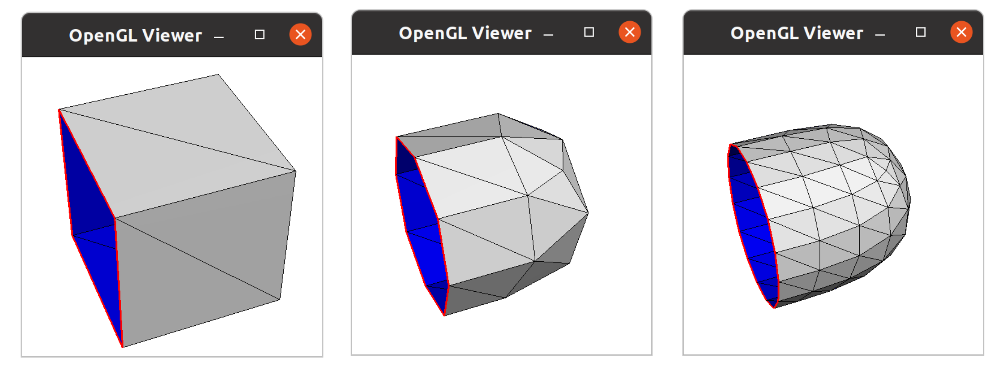

# Work2: 边的化简
code in [HW2](./HW2/)

## 1: load and turn wireframe visualization
编译并且使用命令行
`build/mesher -input cube.obj -size 300`
### 运行结果


按下w：


## 2：边的化简
### 2.1：随机选择边简化
#### 主要思路
- 随机选择一条边，建立新点的位置为两个顶点的中点
- 寻找需要修改的三角形(simply函数)
    - 选择的半边所在的三角形
    - 选择的半边的对边所在的三角形
- 更新三角形
- 具体更新的过程为先删除后增加
#### 运行时出现错误
```c++
void Mesh::addTriangle(Vertex*, Vertex*, Vertex*): Assertion `edges.find(std::make_pair(c,a)) == edges.end()' failed.
```
**分析**：也就是说这对点已经存在在mesh中了,因此我们要查询涉及到的点是否存在重复的。

**策略：**
- 寻找需要修改点的三角形
    - 与被选择的半边三角形相邻的三角形
    - 与被选择的半边的对边三角形相邻的三角形

添加查询设计的点代码如下：
```c++
    //涉及到的点
    std::vector<Vertex*> changedVertex;
    tempEdge = e1->getNext();
    Vertex* tempVertex = tempEdge->getEndVertex();
    while (1) {
        if (tempEdge->getOpposite() == NULL) {
            changedVertex.push_back(tempVertex);
            break;
        }
        if (tempVertex == e1->getOpposite()->getNext()->getEndVertex()) {
            break;
        }
        changedVertex.push_back(tempVertex);
        tempEdge = tempEdge->getOpposite()->getNext();
        tempVertex = tempEdge->getEndVertex();
    }
    //另外半边再来一次
    ...
    
```

当查询到会产生重复时，我们选择的策略是进行提示后直接返回，并且增加选择这条边是否会产生相同的的标识位**isOK**。

代码如下：
```c++
    //判断是否重复即是否有两个相同元素
    std::vector<Vertex*>::iterator it1 = changedVertex.begin();
    std::vector<Vertex*>::iterator it2;
    for (; it1 < changedVertex.end(); it1++) {
        int count = 0;
        for (it2 = changedVertex.begin(); it2 < changedVertex.end(); it2++) {
            if ((*it1)->getIndex() == (*it2)->getIndex()) {
                count++;
            }
        }
        if (count > 1){
          printf( "存在重复，重新选择边\n") ;
          e1->setIsOK(false);
          return;
        }
    }
```

但是有的会出现段错误的问题，有的不会，但是在某些模型某些简化时可以运行。

一开始认为是重新选择边时内存过多，于是在循环中增加循环次数来控制：
```c++
    //重选的次数过大
    if(reChoose>15)break;
```
增加代码后仍然出现段错误，但是在bunny模型不会出现，在dispatch这种模型会出现，认为是选择边的策略出现了问题，增加去除边界边的逻辑，并且与上边的存在相同边的标识位统一为isOK来表示删除这条边是不是可以的，增加getGoodEdge()函数。
```c++
int Mesh::getGoodEdge(){
  int size=0;
  for (edgeshashtype::iterator iter = edges.begin(); iter != edges.end(); iter++) {
        Edge* e = iter->second;
        if (!(e->getIsOK())) {
            continue;
        }
        if (e->getOpposite() == NULL) {
            e->setIsOK(false);
            continue;
        }
        else {
            Triangle* t1 = e->getTriangle();
            Triangle* t2 = e->getOpposite()->getTriangle();
            //此边所在的三角形位于边界
            if (t1->getEdge()->getOpposite() == NULL || t1->getEdge()->getNext()->getOpposite() == NULL || t1->getEdge()->getNext()->getNext()->getOpposite() == NULL||
                t2->getEdge()->getOpposite() == NULL || t2->getEdge()->getNext()->getOpposite() == NULL || t2->getEdge()->getNext()->getNext()->getOpposite() == NULL) {
                e->setIsOK(false);
                continue;
            }
        }
        size++;        
    }
    return size;
}
```
错误解决，运行成功
#### 运行结果


#### 分析
由于是随机选边删除，简化的效果并不好。首先模型很难保证原有的轮廓。面片的大小也不均匀。

### 2.2 QEM简化
#### QEM简化

记 $v=[x,y,z,1]^T$, $p=[a,b,c,d]^T$ ，可得:

考虑一次边收缩，对于两个点，收缩成一个点 $v_1$ , $v_2$ 。定义 $plane(v_i)$ 表示$v_i$对应的那些原始三角面，则我们的优化目标是

$$
\bar{v}=\underset{v}{\arg \min } \sum_{p \in {plane}\left(v_{1}\right) \cup \text { Ulane }\left(v_{2}\right)} {distance}(v, p)^{2}
$$

记 $v=[x,y,z,1]^T$, $p=[a,b,c,d]^T$ ，可得:

$$
{distance}(v, p)^{2}=\left(v^{T} p\right)^{2}=v^{T} p p^{T} v=v^{T} K_{p} v
$$

令 $Q_{i}=\sum_{p \in \text { plane }\left(v_{i}\right)} K_{p}$ 则有:

$$
\bar{v}=\underset{v}{\arg \min } v^{T}\left(Q_{1}+Q_{2}\right) v
$$


#### 主要思路
- 设计数据结构Pair
- 对每个平面计算Kp
- 计算每个点的Q
- 计算最小的distance

设计Pair，代码如下：
```c++
class Pair {
public:
	Pair(Vertex* a, Vertex* b,Edge *ee) :p1(a), p2(b),e(ee),distance(0) {}
    Vertex* getP1(){return p1;}
    Vertex* getP2(){return p2;}
    Edge* getEdge(){return e;};
    void computeDistance(double MaxDis);
    double  getDistance(){return distance;};
    Vec3f getResult(){return result;};
    void setDistance(double dis){distance=dis;}
    void setResult(Vec3f v){result=v;}
private:
    Vertex* p1;
	Vertex* p2;
	double distance;
	Vec3f result;
	Edge* e;
};
```
Pair.cpp，代码如下：
```c++
#include "Pair.h"
#include "matrix.h"

void Pair::computeDistance(double MaxDis){
    Matrix Q = p1->getQ() + p2->getQ();
    Matrix Q1(Q);
    Q1.set(3, 0, 0); 
    Q1.set(3, 1, 0); 
    Q1.set(3, 2, 0); 
    Q1.set(3, 3, 1);
    Vec4f temp_result;
    Matrix Q1_Inverse;
    int inverse_able = Q1.Inverse(Q1_Inverse); 
    if (!inverse_able) {
        //Q1不可逆，从v1 v2上找一个cost最小的点
        double mink = 0, minDis = MaxDis; 
        double cost;
        for (double k = 0; k <= 1; k = k + 0.1) {
            temp_result = Vec4f((1 - k) * p1->x()+ k * p2->x(), (1 - k) * p1->y() + k * p2->y(), (1 - k) * p1->z() + k * p2->z(), 1);
            cost = temp_result.Dot4(Q * temp_result);
            if (cost < minDis) {
                mink = k; 
                minDis = cost;
            }
        }
        temp_result = Vec4f((1 - mink) * p1->x() + mink * p2->x(), (1 - mink) * p1->y() + mink * p2->y(), (1 - mink) * p1->z() + mink * p2->z(), 1);
        setDistance(minDis);
    }else {
        //Q1可逆
        temp_result=Vec4f(0, 0, 0, 1);
        Q1_Inverse.Transform(temp_result);
        setDistance(temp_result.Dot4(Q*temp_result));
    }
    setResult(Vec3f(temp_result.x(),temp_result.y(),temp_result.z()));
  }
```
#### 运行结果 


#### 分析
对比随机选边算法，QEM算法对模型的简化效果有提高。因为这个算法基于边的筛选和边distance的计算，避免了简化过程中边界的改变，并且使得保持轮廓。另外，该算法的执行效率并没有明显的下降。

## 3：Loop Subdivision
Piecewise Smooth SurfaceReconstruction 主要是对顶点进行了分类，对crease边根据不同顶点类型进行细分，对旧顶点位置也进行更新
### 算法主要思路
- 预处理，先对所有顶点根据入度s进行分类
    - s=0:smooth
    - s=1:dart
    - s=2:crease
      - regular-crease:
        - 顶点不在边界上，顶点共与6条边相连，且两条crease每边有2条smooth边
        - 顶点在边界上，周围相连边的数量为4
      - non-regular crease: 不是regular的剩下都是non-regular
    - s>2:corner
- 为每条边计算一个新顶点
  - 边界边：新点的坐标为两个旧点的平均
  - crease边：提出了三种细分的mask，并且根据每条边两端的点的种类提出对应的细分mask如图所示：


  - 普通边:按照edge mask处理:

    

- 更新顶点位置，根据顶点的类型如下图所示：

  
  
- 更新网格的拓扑结构，对每个三角形，由一个三角形生成四个三角形

### 运行结果




### 分析

Piecewise Smooth SurfaceReconstruction 的主要目的是保持模型原有的“锋利”。所以对crease边根据不同顶点类型进行了细分，观察提出的方法可以知道crease边采取的权重分配方式，最终生成的新顶点必定也会在这条边上，因此能保持crease边的“锐利”。而smooth edge就会受到周围另外两个顶点的影响，会使新生成的点“弓起来”。

## 4：ButterflySubdivision
### 算法主要思路

与Piecewise Smooth SurfaceReconstruction相似，但是ButterflySubdivision不进行旧点的更新

- 规定了一系列新顶点的计算规则：
  - 当新插入的点所在边的两个端点的度均为6时


  - 当该奇点所在边的两个端点中，一个端点的度为6，另一个不为6时


  - 当该新边点所在边的两个端点的度均不为6时


  - 若为边界或者crease边
  


- 网格拓扑结构更新同3：Loop Subdivision

### 运行结果


### 分析

对于模型的平滑方面效果没有LoopSubdivision好，不过该方法会保留甚至强调模型原有的突起部分细节。LoopSubdivision可以发现，在没有crease边的限制下，ButterflySubdivision会造成不规则的起伏，LoopSubdivision得到的结果会更加有规则，更加对称。

## 5：总结
通过这个实验我对图形的简化和细分有了进一步的认识。
- 1.了解了半边数据结构，本实验采用这种数据结构，对模型数据进行储存。这种结构将一个边分为两个半边，并且建立这两个边之间的联系，十分巧妙。具体使用链表的结构，具有很高存取的效率，对边、面的获取都十分方便，但是算法的实现过程要注意的问题比较复杂。
- 2.实现了随机坍缩和QEM坍缩，对于QEM来说，坍缩具有一定的策略，比随机坍缩针对模型轮廓的问题具有很好的效果。
- 3.实现了LoopSubdivision和ButterflySubdivision算法。在细化（平滑）的过程中，注意到了保留锋利部分。LoopSubdivision通过定义crease边的更新权重来保留锋利部分，而ButterflySubdivision只增加计算新点的规则而没有更新旧点，所以他的平滑效果不如LoopSubdivision，但是更加突出了锋利的部分。

