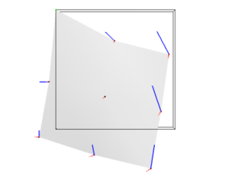
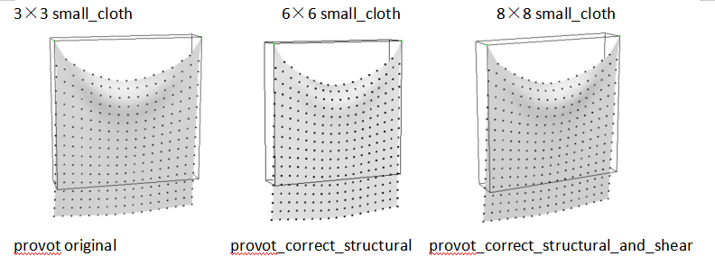
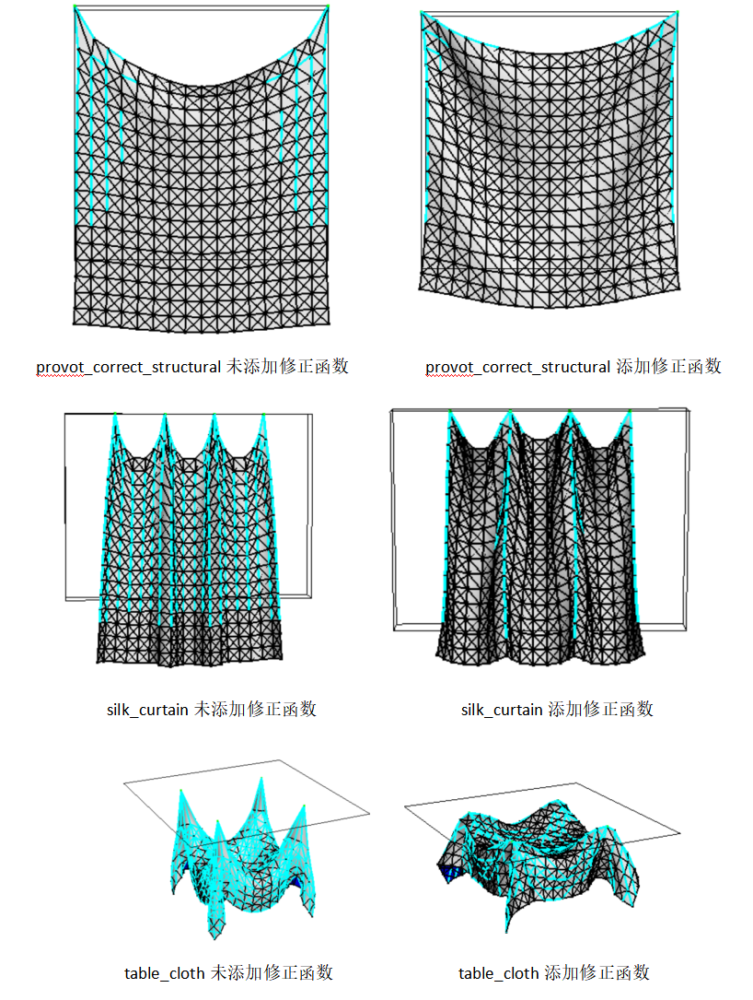
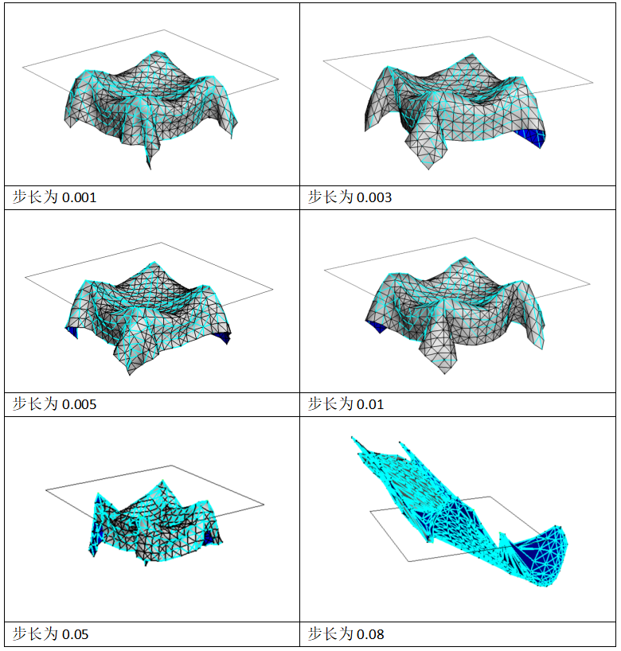
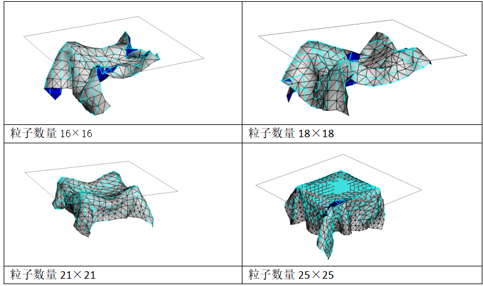
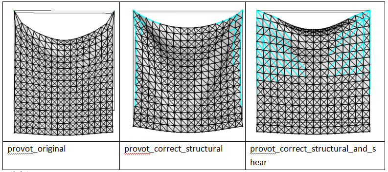
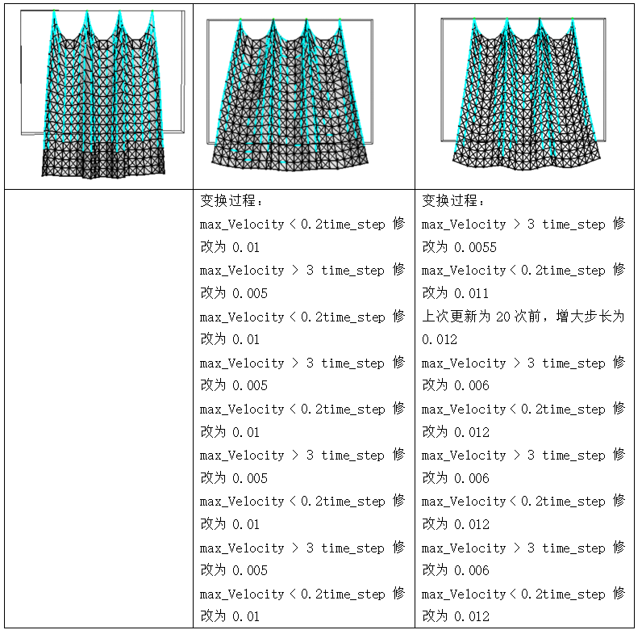
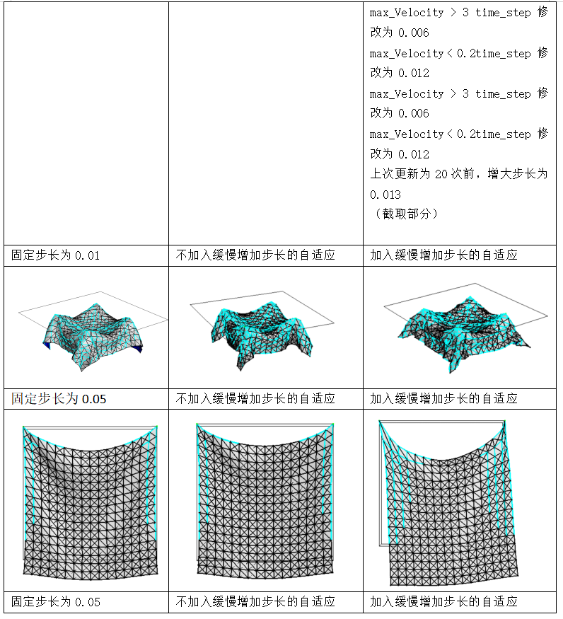
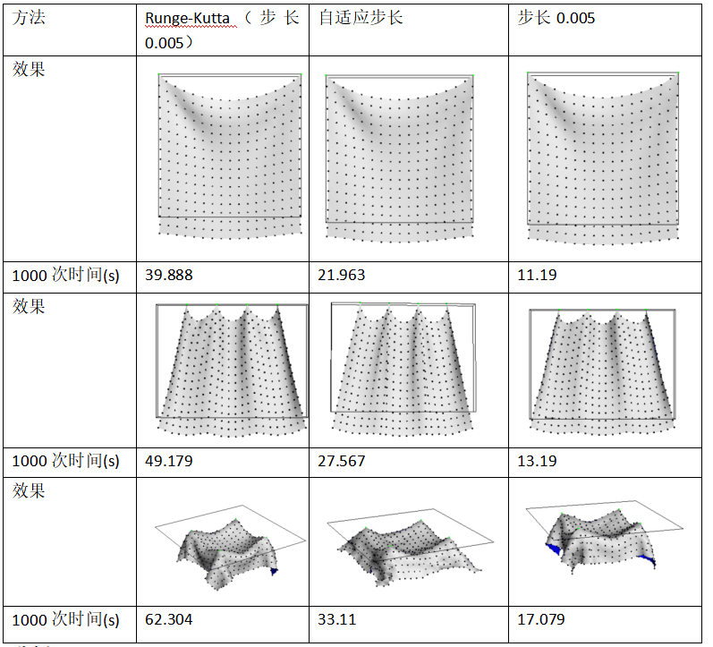

# Work3: 基于物理的模拟
code in [HW3](./HW3/)

## 1 力的可视化
主要是修改cloth_render.cpp，仿照对速度的可视化进行代码的书写。

**效果：**

按下’f’，显示力的可视化

其中红线代表速度，蓝线代表力

## 2 实现质量的基本动画

**主要思路：**
根据文章 `Deformation Constraints in a Mass-Spring Model to Describe Rigid Cloth Behavior", Xavier Provot, 1995`。
1. 计算每个粒子所受合力F，包含重力、弹簧力、系统阻尼这三部分力。
2. 根据合力计算粒子在一个步长之后的加速度、速度及位置
3. 更新粒子信息

**效果：**

**分析：**

针对每个粒子进行受力分析，基于物理学来更新各个粒子的信息。在small_cloth、provot original中的实验效果都不错可以基本的描述布料运动的过程。针对对small_cloth粒子数量的修改，可以发现随着粒子数量的增加，对布料运动模拟的真实感也会上升。
## 3 对拉伸超过指定阈值的弹簧实施迭代调整
Provot在文章中说到，角落的弹簧会拉伸得太大。因此引入对拉伸超过指定阈值的弹簧实施迭代的调整方法。

**调整策略：**

**效果：**

**分析：**

对拉伸超过指定阈值的弹簧进行调整，添加修正函数，修正对应粒子的信息。在provot_correct_structural、silk_curtain、table_cloth进行实验。可以看出未添加修正函数时，拉伸有些过度，尤其是silk_curtain和table_cloth中大多数的弹簧都显示出了青蓝色，添加修正函数后，过度拉伸的问题得到一定程度的解决，布料的运动模拟也更加自然。

## 4 调整参数测试模拟的稳定性   
### 4.1 修改步长     
**效果：**

              
1. 首先最显著的变化是物体到达最终形态的速度更快了。

2. 其次可以观察到当步长增加时，关于布料运动的细节减少了。并且当步长增加时，在固定点的拉伸程度比步长短时更为明显，可以观察到步长为0.003、0.005、0.01、0.05的时候都比步长为0.001的时候固定点的位置尖锐。

3. 当步长为0.08时，运动变得极为不稳定（如图所示），并且运行一会造成了程序的崩溃,即发生了**cloth explode**。

**分析:**

1. 最终形态的速度更快是因为步长变长，那么可以看作所计算的速度的加速度、速度、位置达到最终形态的时间变短了。

2. 因为步长变长，可以看作跳过了一些步骤这时一些运动的细节就会消失。

3. 当步长超大时，内部的弹力在步长较大时会形成一种拉扯的形态。此时已经违背了物理学，没有很好的使用迭代描述运动的过程。

### 4.2 改变粒子数量(步长固定为0.02)
**效果：**

	
**分析：**

可以看到改变粒子数量时粒子之间的弹力也会增加。对粒子数量21×21的模拟是最好的,其他数量时都有 一定把背面翻过来的情况。

### 4.3 修改弹簧变形率系数
**效果：**

**分析：**
provot_original、provot_correct_structural、provot_correct_structural_and_shear分别对应不限制变形率、仅限制structural springs的变形率、限制structural springs和shear springs的变形率。在此基础上应用修正函数并且设置步长为0.02。可以看到随着变形率的减小,确实模拟出来了拉伸效果的减小。

## 5 自适应步长

从4.1的实验可知,当步长较小时对布料的模拟是比较稳定的。但是适当的更大的步长可以更快的到达最终状态。但是过大的步长可能会导致cloth explode。因此，设计自适应步长的布料运动模拟算法。

受第3节对拉伸超过指定阈值的弹簧算法的启发,评价一个模拟是不是稳定的,我们认为当加速度、速度、位置超过一个阈值时,系统是不稳定的。具体来说,我们检查所有粒子的速度,取粒子速度的最大值.如果最大值大于阈值则将步长降低为一半。若小于一个阈值时,则步长增加一倍。

同时当越达到约定状态时，步长对运动的改变越小。为了加快达到稳定状态的速度，当长时间没有更新时，比如上次更新为20帧之前，缓慢增加步长。

**效果：**

参数如下：
- 初始步长0.005
- 速度阈值为0.2-3
- time_step的范围为0.0005到0.015

	
**分析：**

当加入缓慢增加变换步长时，可以看出因为步长大部分时间比不加入缓慢增加步长的自适应步长算法要高，因此运动的细节没有不加入缓慢增加步长的自适应步长算法处理的好。根据不加入缓慢增加步长的输出，可以看出步长的变化是比较简单的，类似于二值分类，但是却在速度和质量之间提供了一个非常好的结果。

## 6 Runge-Kutta

引入四阶Runge-Kutta法对粒子状态进行更新。

四阶Runge-Kutta格式如下：

具体来说，按照公式完成四部分计算，最终完成更新。四部分计算分别是1/6、1/3、1/3、1/6，最终再整合在一起。

**效果：**

**分析：**

可以看出Runge-Kutta的方法模拟出来的效果是最好的，但是迭代1000次耗费的时间大约是2倍的自适应步长耗费的时间，4倍步长固定的原始方法所耗费的时间。但是有可能在1000次迭代之前已经到达了非常好的状态，所以实际可能不用消耗这么长时间。

## 7 cloth.exe用法
命令格式：
`cloth.exe -cloth “*.txt” -timestep 0.005 -animatetype animate -iterations 2000 -dynamicInverseConstraints` 

参数说明：
- cloth后跟布料.txt路径
- timestep后跟步长
- animatetype 表明动画模拟方法。可选项：animate、runge_kutta、adaptive_timestep，默认为animate即基本方法。runge_kutta表示使用runge_kutta方法。adaptive_timestep表示使用步长自适应。
- dynamicInverseConstraints表示对拉伸超过指定阈值的弹簧实施迭代调整，不写这一参数表示false
- iterations表示迭代的次数，不指定iterations时，默认为一直迭代。
- cloth后跟布料.txt路径
- timestep后跟步长
- animatetype 表明动画模拟方法。可选项：animate、runge_kutta、adaptive_timestep，默认为animate即基本方法。runge_kutta表示使用runge_kutta方法。adaptive_timestep表示使用步长自适应。
- dynamicInverseConstraints表示对拉伸超过指定阈值的弹簧实施迭代调整，不写这一参数表示false
- iterations表示迭代的次数，不指定iterations时，默认为一直迭代。

一些示例如下：
1. 调用Basic Method模拟small_cloth，步长为0.005，使用拉伸阈值方法，不指定迭代次数：
1. 调用Basic Method模拟small_cloth，步长为0.005，使用拉伸阈值方法，不指定迭代次数：
`cloth.exe -cloth ./data/small_cloth.txt -timestep 0.005 -animatetype animate -dynamicInverseConstraints`

2. 调用Basic Method模拟silk_curtain，步长为0.005，不使用拉伸阈值方法，不指定迭代次数：
2. 调用Basic Method模拟silk_curtain，步长为0.005，不使用拉伸阈值方法，不指定迭代次数：
`cloth.exe -cloth ./data/silk_curtain.txt -timestep 0.005 `

3. 调用Basic Method模拟table_cloth，步长为0.005，使用拉伸阈值方法，指定迭代次数为5000：
3. 调用Basic Method模拟table_cloth，步长为0.005，使用拉伸阈值方法，指定迭代次数为5000：
`cloth.exe -cloth ./data/table_cloth.txt -timestep 0.005 -animatetype animate -dynamicInverseConstraints -iterations 5000`

4. 调用Runge Kutta Method模拟table_cloth，步长为0.005，使用拉伸阈值方法，指定迭代次数为5000次：
4. 调用Runge Kutta Method模拟table_cloth，步长为0.005，使用拉伸阈值方法，指定迭代次数为5000次：
`cloth.exe -cloth ./data/table_cloth.txt -timestep 0.005 -animatetype runge_kutta -dynamicInverseConstraints -iterations 5000`

5. 调用Runge Kutta Method模拟silk_curtain，步长为0.005，不使用拉伸阈值方法，不指定迭代次数：
5. 调用Runge Kutta Method模拟silk_curtain，步长为0.005，不使用拉伸阈值方法，不指定迭代次数：
`cloth.exe -cloth ./data/silk_curtain.txt -timestep 0.005 -animatetype runge_kutta`

6. 调用Adaptive Timestep Method模拟silk_curtain，步长为0.001，使用拉伸阈值方法，指定迭代次数2000：
6. 调用Adaptive Timestep Method模拟silk_curtain，步长为0.001，使用拉伸阈值方法，指定迭代次数2000：
`cloth.exe -cloth ./data/silk_curtain.txt -timestep 0.001 -animatetype adaptive_timestep -dynamicInverseConstraints -iterations 2000`

7. 调用Adaptive Timestep Method模拟table_cloth，步长为0.001，使用拉伸阈值方法，不指定迭代次数2000：
7. 调用Adaptive Timestep Method模拟table_cloth，步长为0.001，使用拉伸阈值方法，不指定迭代次数2000：
`cloth.exe -cloth ./data/table_cloth.txt -timestep 0.001 -animatetype adaptive_timestep -dynamicInverseConstraints`